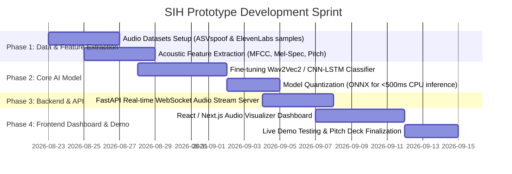

# 🛠️ V-Shield AI: Prototype Roadmap & Implementation Plan
## Problem Statement: `SIH26102` (Voice Cloning Detection)

---

## 🎯 The Prototype Vision
A fully working prototype consisting of:
1. **The Audio Forensics Engine (Python/PyTorch):** Ingests any `.mp3`/`.wav` recording or live mic stream $\rightarrow$ extracts acoustic & neural features $\rightarrow$ outputs a **Synthetic Voice Probability Score (0-100%)**.
2. **The Web Forensic Dashboard (React/Next.js):** 
   * Live audio recording / file upload.
   * Interactive audio waveform & Mel-Spectrogram visualizer (via Wavesurfer.js).
   * Visual indicator: 🟢 **REAL HUMAN VOICE** vs 🔴 **AI SYNTHETIC CLONE DETECTED**.
   * One-click **Forensic Investigation Report (PDF)** export.

---

## 📅 3-Week Prototype Sprint Timeline

---

## 👥 Team Workload Breakdown (6 Members):

* **Member 1 (Rohit - Lead AI & Architecture):** Audio preprocessing, feature extraction pipeline (Librosa / PyTorch), and model inference.
* **Member 2 (ML Engineer):** Dataset curation, model evaluation on diverse Indian accents, and threshold tuning.
* **Member 3 (Full-Stack Frontend):** Next.js dashboard, visual spectrogram heatmaps, and audio recording interface.
* **Member 4 (Backend & API):** FastAPI backend, WebSocket streaming, and PDF report generator.
* **Member 5 (Mobile / App UI):** Mobile prototype screen (Android caller warning overlay concept).
* **Member 6 (UI/UX & Documentation):** Official SIH PPT deck, system flowcharts, and video demonstration.
