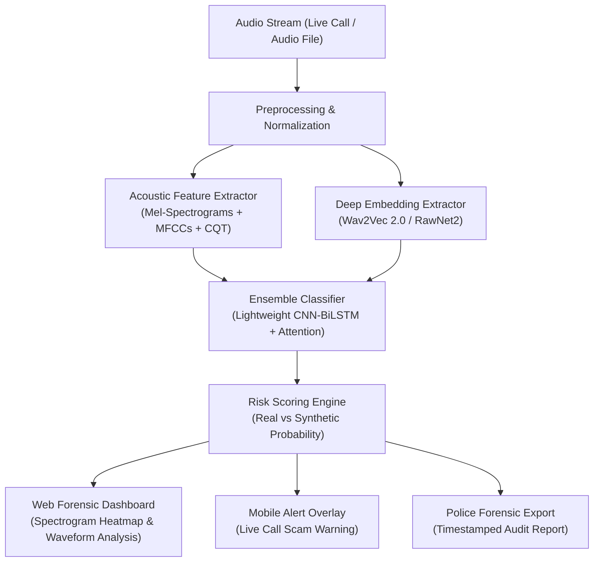

# 📑 SIH 2026: Official Idea Presentation Content Guide
## Problem Statement ID: `SIH26102`
## Problem Title: AI-Powered Real-Time Detection and Prevention of Voice Cloning Impersonation Attacks

---

### 🖼️ SLIDE 1: Title & Team Overview
* **Problem Statement ID:** `SIH26102`
* **Problem Title:** AI-Powered Real-Time Detection and Prevention of Voice Cloning Impersonation Attacks
* **Theme:** Security & Surveillance / Cyber Security
* **Team Name:** [Your Team Name]
* **Team Leader:** Rohit Singh
* **College Name / Institute:** [Your College Name]

---

### 💡 SLIDE 2: Proposed Solution
* **Project Name:** **V-Shield AI** *(Real-Time Voice Antispoofing & Deepfake Detection Engine)*
* **Core Value Proposition:**
  * An intelligent, dual-engine audio forensic system that analyzes live audio streams and voice calls to detect synthetic/cloned speech in **sub-second latency (<800ms)**.
* **Key Innovations:**
  1. **Acoustic Artifact Detection:** Analyzes spectral discontinuities, breathing patterns, and unnatural pitch transitions characteristic of TTS/Neural voice cloners (ElevenLabs, Tortoise-TTS, RVC).
  2. **Multi-Feature Fusion Engine:** Combines Mel-Frequency Cepstral Coefficients (MFCCs), Constant Q Transform (CQT), and Raw Waveform embeddings.
  3. **Live Alert Overlay:** Instant visual & haptic alert on the user's screen when cloned speech probability exceeds threshold (>85%).

---

### ⚙️ SLIDE 3: Technical Approach & System Architecture

* **Tech Stack:**
  * **ML/Audio Backend:** Python, PyTorch, Librosa, HuggingFace (`wav2vec 2.0`), FastAPI.
  * **Frontend / Dashboard:** Next.js / React, TailwindCSS, Wavesurfer.js (waveform visualization).
  * **Mobile Integration:** Android (React Native / Flutter WebRTC stream interceptor).
  * **Cloud / Hosting:** Microsoft Azure (FastAPI Container on Azure App Services).

---

### 📊 SLIDE 4: Feasibility, Viability & Challenges

| Aspect | Feasibility Strategy |
| :--- | :--- |
| **Training Data** | Pre-trained on global benchmarks (**ASVspoof 2021**, **In-The-Wild Audio Deepfake**, **FakeAVCeleb**) + fine-tuned on diverse Indian accents and regional languages. |
| **Latency Constraint** | Quantized ONNX model engine capable of running inference in **<500ms** on edge/CPU without requiring high-end GPUs. |
| **Noise Robustness** | Data augmentation with ambient traffic, background static, and telephone compression codecs (G.711 / AMR). |

---

### 🛡️ SLIDE 5: Social Impact & Law Enforcement Utility

1. **Protecting Vulnerable Citizens:** Directly halts emergency impersonation scams ("Digital Arrest", family kidnapping extortion) targeting senior citizens and parents.
2. **Law Enforcement Forensics:** Enables Cyber Crime Cells (1930 / I4C) to verify recorded scam call audio with mathematical authenticity certificates.
3. **Banking & V-KYC Security:** Prevents voice-spoofed unauthorized transactions and biometric identity theft in Video-KYC verification.

---

### 🛠️ SLIDE 6: Tech Stack & Tools Reference
* **Models:** `wav2vec 2.0`, `RawNet2`, `Lightweight CNN-BiLSTM`
* **APIs:** FastAPI, WebSockets (for live audio chunk streaming)
* **Dataset Benchmarks:** ASVspoof 2021, LibriSpeech, ElevenLabs Synthesized Benchmark
* **Infrastructure:** Microsoft Azure, Docker
